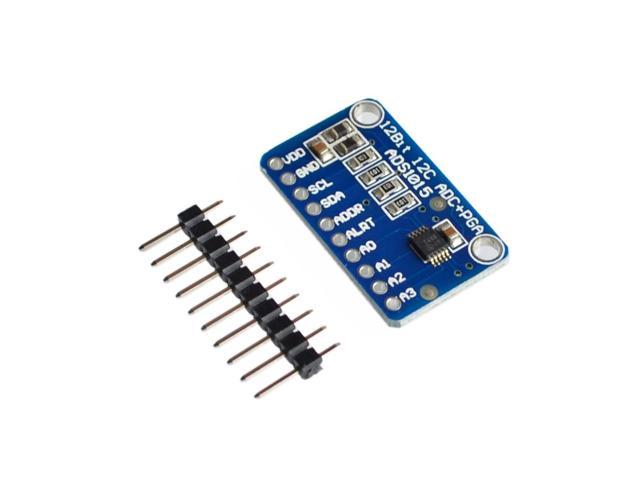

# ADS1015 Lua driver

A [lua-periphery](https://github.com/vsergeev/lua-periphery) based sensor driver for the ADS1015 4-channel analog-to-digital converter (ADC) with 12-bit precision and programmable gain amplifier (PGA).

## Installing

If you are on Linux:

```sh
$ luarocks install ads1015
```

Otherwise, you can use the Lua module from within a Go app via [glua-periphery](https://github.com/BixData/gluaperiphery).

## Using

### Taking a single-ended reading

The following script takes a single-ended (non-differential) reading from channel 0 which has been tied to 3.3V.

```lua
local ads1015 = require 'ads1015'
local periphery = require 'periphery'

local i2c = periphery.I2C('/dev/i2c-1')
local device, channel, gain, dataRate = 0x48, 0, 1, nil
local value = ads1015.readADC(i2c, device, channel, gain, dataRate)
print(string.format('raw value  = %d', value))
print(string.format('as voltage = %f V', ads1015.toVoltage(value, gain)))
```

Sample output:

```
raw value  = 1641
as voltage = 3.283603 V
```
